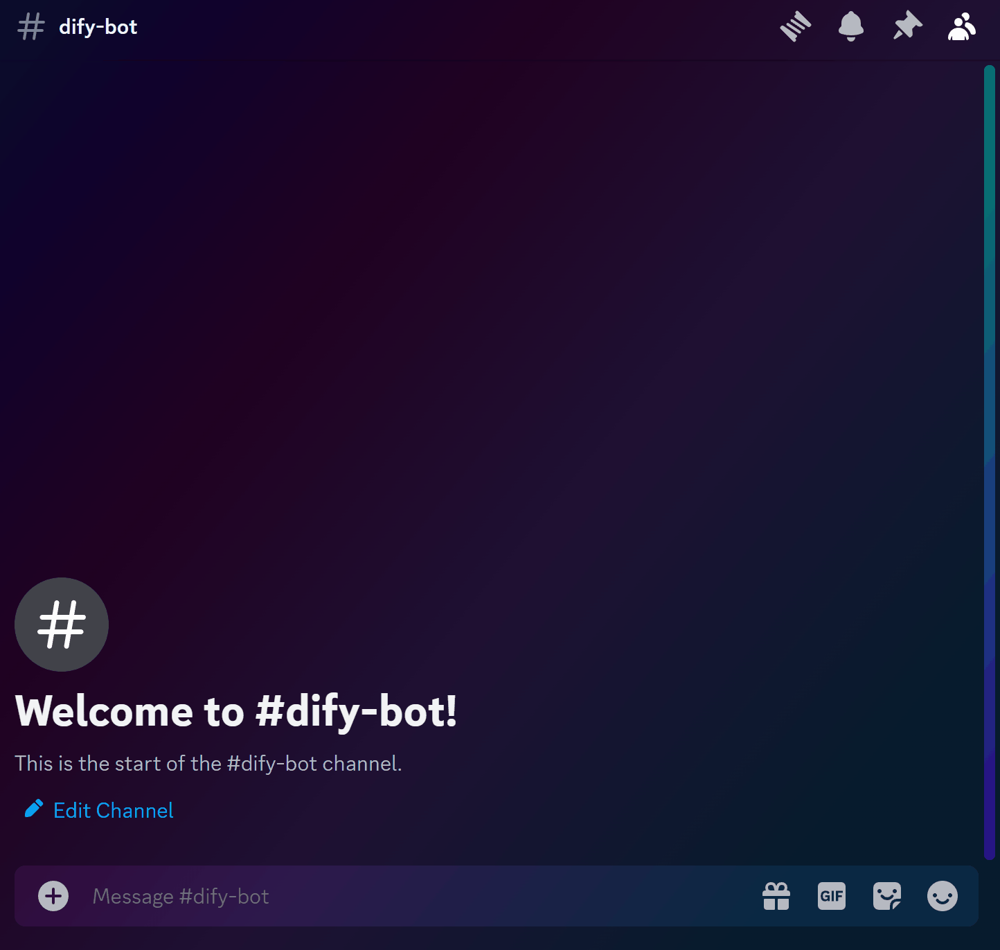

# Dify-Discord-Starter 🤖✨

Welcome to the **Dify-Discord-Starter** project! This is a modern and easy-to-use starter template for creating a Discord bot that integrates with the Dify app. Use this template to build your own bot and enable interactive chatting capabilities within your Discord community.

<p align="center">
  
  <i>Demo made with the <a href="assets\example_app.yml">Example Dify App</a></i>
</p>

## Features 🚀

- **Slash Command Support**: Users can interact with your bot using the `/chat` command directly in Discord.
- **Integration with Dify**: Seamlessly send and receive messages through the Dify app.
- **Ephemeral Responses**: Keep conversations private by sending ephemeral messages that only the command user can see.
- **Simplified Bot Installation**: Easily add your bot to any Discord server with a single command.
- **Versatile Application**: This starter is designed to work with all dify assistant types, from a basic assistant to an agent chatbot or a complex chatflow.

## Prerequisites 📋

Before you begin, ensure you have the following installed:

- Node.js (v14 or higher)
- npm (comes with Node.js)

## Setup 🛠️

1. **Clone the Repository**

   ```sh
   git clone https://github.com/your-username/dify-discord-starter.git
   cd dify-discord-starter
   ```

2. **Environment Variables**

   - Rename `.env-example` to `.env`.
   - Fill in the environment variables with your own values.

   ```plaintext
   DIFY_API_KEY="app..." # Your Dify API secret key
   DIFY_API_BASE_URL="https://api.dify.ai/v1" # Your Dify instance base URL
   DISCORD_BOT_TOKEN="" # Your Discord bot token from Discord Developer Portal
   ```

3. **Install Dependencies**

   ```sh
   npm install
   ```

4. **Build the Project**

   ```sh
   npm run build
   ```

5. **Start the Bot**

   ```sh
   npm start
   ```

   Upon startup, the bot will log a message in the console with a link to add the bot to your Discord server.

6. **Add Your Bot to a Discord Server**
   Use the provided link in the console to add your bot to a Discord server.

7. **Install Slash Commands**
   ```sh
   npx ts-node scripts/install.ts <server-id>
   ```
   Replace `<server-id>` with the ID of the server where you want to install the command.

## Usage 📖

Once the bot is added to your server and the slash command is installed, you can interact with it using the `/chat` command. Simply type `/chat` followed by your message, and the bot will respond with an ephemeral reply from the Dify app.

## Scripts 📜

- `npm run build`: Compiles the TypeScript code to JavaScript, preparing it for execution.
- `npm start`: Starts the bot using the compiled JavaScript code.
- `npm run dev`: Runs the bot in development mode with hot reloading, ideal for development purposes.
- `npm run install-cmd`: A shortcut script to run the install command script.

## Dify variables

By default the discord bot will pass the name of the user to the assistant, within the dify variable `username` and the current date as UTC string within the dify variable `now`. In case of channel messages, the variable `channel_id` will also be defined. 

## Conversation History

You can set the environment variable `HISTORY_MODE` to enable chat history. Currently the history is stored in memory, if you restart the bot, it will forget the history.
Be aware that currently, there is no mechanic to clear or summarize the history. This means, that if users send too many messages, you might reach the token limit of the assistant.

If you do not set this variable, the bot will not remember messages - the bot will even forget the last message the bot has sent to the channel.

### History per user

Set it to `user` if you want the bot to enable an own chat history for every user. The assistant will remember every message of the user accross channels and servers.

### History per channel

Set it to `channel` if you want the bot to enable a history for channels. The assistant will remember every message in the channe regardless from which user it came. You should use the dify variable "username" to allow the bot recognize the author of messages, otherwise the assistant will think all messages come from the same user.

Hint: If you use this, the userId of messages will no longer be the user but the server id, since dify does store conversations per user - if you share conversations accross users, you cannot pass the userid since dify would still create a unique conversation per user.

## Triggering the bot

There are three ways to trigger the bot:

- application command: The bot will handle the `/chat` command if the application commands have been installed to the server and the user has permissions to use them.
- mention: The bot will reply if it is mentioned in a message.
- keywords: The bot will reply if a new message on a text channel contains a one of the configured keywords. The keywords are defined in the `TRIGGER_KEYWORDS` environment variable. This will only work if the bot has permission to read message contents, which must be enabled in the Discord Developer Portal, and the `MESSAGE_CONTENT_ALLOWED` environment variable must be set to `true`. Please read [Message-Content-Privileged-Intent-FAQ](https://support-dev.discord.com/hc/en-us/articles/4404772028055-Message-Content-Privileged-Intent-FAQ) if you want to use this. Use with caution, as this will trigger the bot on every message that the bot is able to read.

## Webhook Feature 🌐

The project supports webhooks, allowing you to send messages on behalf of the bot user. This can be useful for integrating external events or notifications into your Discord Bot.

### Setting Up the Webhook Server

1. **Set the API Key**

   Make sure to set the `WEBHOOK_API_KEY` in your `.env` file. This is required to enable the webhook server.

   ```plaintext
   WEBHOOK_API_KEY="your-webhook-api-key"
   WEBHOOK_PORT=3000 # Optional, default is 3000
   ```

2. **Start the Webhook Server**

   The webhook server will automatically start when the bot starts and the `WEBHOOK_API_KEY` is set.

### Using the Webhook Server

To send a message via the webhook server, you need to send a POST request to the endpoint `/webhook/:channelId`. Replace `:channelId` with the ID of the Discord channel where the message should be sent.

#### Example Request

```sh
curl -X POST http://localhost:3000/webhook/your-channel-id \
     -H "Content-Type: application/json" \
     -H "x-api-key: your-webhook-api-key" \
     -d '{"content": "Hello, this is a webhook message!"}'
```

### Webhook Rate Limiting

The webhook endpoints are rate limited to prevent abuse. You can configure the rate limit by using the following environment variables:

- `WEBHOOK_RATE_LIMIT_WINDOW`: The time window in milliseconds for which requests are counted. (Default: 900000 ms for 15 minutes)
- `WEBHOOK_RATE_LIMIT_MAX`: Maximum number of requests allowed per IP within the time window. (Default: 100)

Make sure to update your `.env` file accordingly if you want to adjust these settings.

### Error Handling

The webhook server returns appropriate HTTP status codes to indicate the status of the request:

- `200 OK`: The message was successfully sent.
- `400 Bad Request`: Invalid message content.
- `403 Forbidden`: Invalid API key.
- `500 Internal Server Error`: An error occurred.

This feature allows you to seamlessly integrate external systems into your Discord server and send automated messages.

## Contributing 🤝

Contributions are what make the open-source community such an amazing place to learn, inspire, and create. Any contributions you make are **greatly appreciated**.

1. Fork the Project
2. Create your Feature Branch (`git checkout -b feature/AmazingFeature`)
3. Commit your Changes (`git commit -m 'Add some AmazingFeature'`)
4. Push to the Branch (`git push origin feature/AmazingFeature`)
5. Open a Pull Request

## License 📝

Distributed under the MIT License. See `LICENSE` for more information.

## Acknowledgements 🙏

- [Discord.js](https://discord.js.org/#/)
- [Dify.ai](https://dify.ai/)
- [Node.js](https://nodejs.org/)

---

Happy Coding! 🎉👩‍💻👨‍💻

_Note: This is a starter project and is not affiliated with the official Dify platform or Discord._
